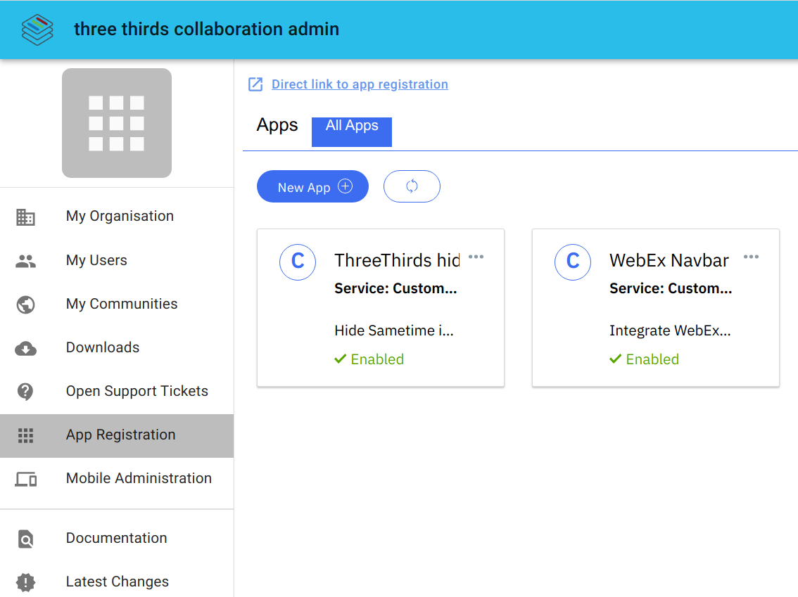

# Connections Application Register (AppReg)

## Where to find

Organizaton Administrators can add custom Extensions via our admin portal [EU](https://admineu.collab.cloud) / [NA](https://adminna.collab.cloud).

## What is it for

With the appregistry you're able to enable or disable customizations.

There is a "ThreeThirdsHeader header V2" already there. This integrates our header links into connections. Disabling or deleting this app is not recommended.

The official HCL documentation to the appregistry can be found [here](https://github.com/hclcnxdev/customizer/blob/master/docs/HCLConnectionsCustomizer.md) and examples are on the [HCL github](https://github.com/hclcnxdev) page.

## What is possible

Anything that can be done with javascript and css on the connections pages.

- add items to the header like links to other apps
- hide or change the images and logos
- add a link to your online meeting tool
- see the documentation for more samples
- see our [Webex](extension-webex.md) example

## Limitations

There's no automatic way to upload the additional files - JavaScript and/or CSS - for your extension.
Please create a ticket for that. So we're able to upload them to the right position and provide you with the correct path for the appregistry entry.
