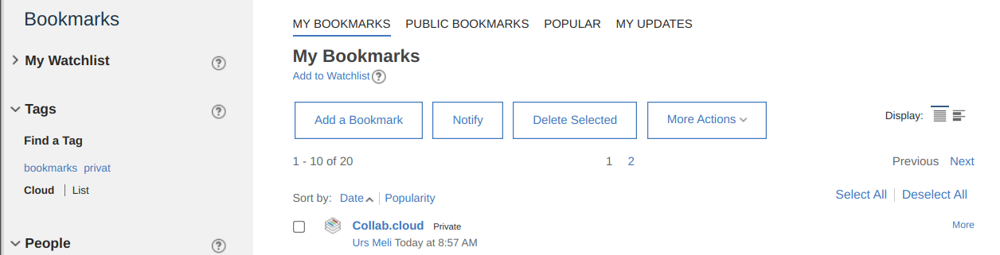
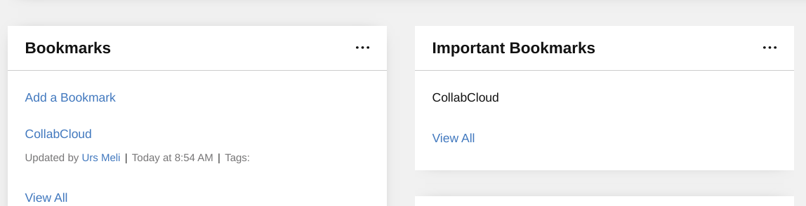
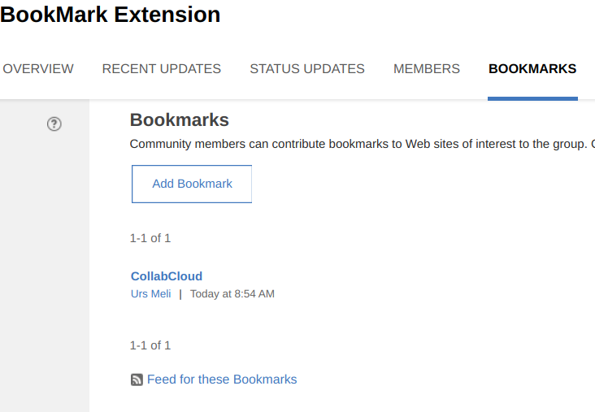

# Open all Bookmarks in new Tab extension

If you or your users use the bookmark app and community widget, you might want to change the default behaviour when you open a link.

## Changes

In your private bookmark page:



In the community overview for bookmarks and important bookmarks



In the community bookmarks:



## Installation

Open the Admin app and goto App Registration. And create a new app.

### Open the code editor

Directly open the code editor.


### Replace the default content

Remove the default content and paste the JSON below into the editor.

```json
{
    "name": "ttt.bookmarks",
    "title": "Bookmark",
    "description": "Open Bookmarks in new Window",
    "services": [
        "Customizer"
    ],
    "state": "enabled",
    "extensions": [
        {
            "name": "100-ttt.bookmarks",
            "type": "com.ibm.customizer.ui",
            "payload": {
                "include-files": [
                    "extensions/ttt.bookmarks/js/bookmarks.js"
                ],
                "cache-headers": {
                    "cache-control": "max-age=30"
                }
            },
            "path": "global",
            "state": "enabled"
        }
    ]
}
```

Once the app is enabled, bookmarks should now open in new tabs.
