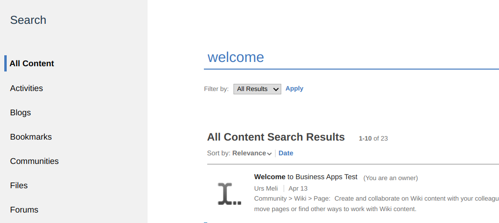

# Searchresults extension

Tired of loosing your searchresults when you click on one?
Connections default is to open the search result in the current window. So your users need to right-click or CTRL-click on the links.
This extensions changes the default target for links in the search app:



## Installation

Open the Admin app and goto App Registration. And create a new app.

### Open the code editor

Directly open the code editor.


### Replace the default content

Remove the default content and paste the JSON below into the editor.

```json
{
    "name": "ttt.searchresults",
    "title": "Searchresults",
    "description": "Open Searchresults in new Tab",
    "services": [
        "Customizer"
    ],
    "state": "enabled",
    "extensions": [
        {
            "name": "101-ttt.searchresults",
            "type": "com.ibm.customizer.ui",
            "payload": {
                "include-files": [
                    "extensions/ttt.searchresults/js/searchresults.js"
                ],
                "cache-headers": {
                    "cache-control": "max-age=30"
                }
            },
            "path": "global",
            "state": "enabled"
        }
    ]
}
```

Once the app is enabled, searchresults should now open in new tabs.
