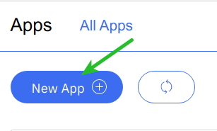
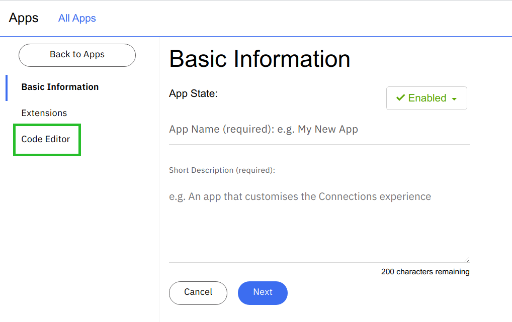
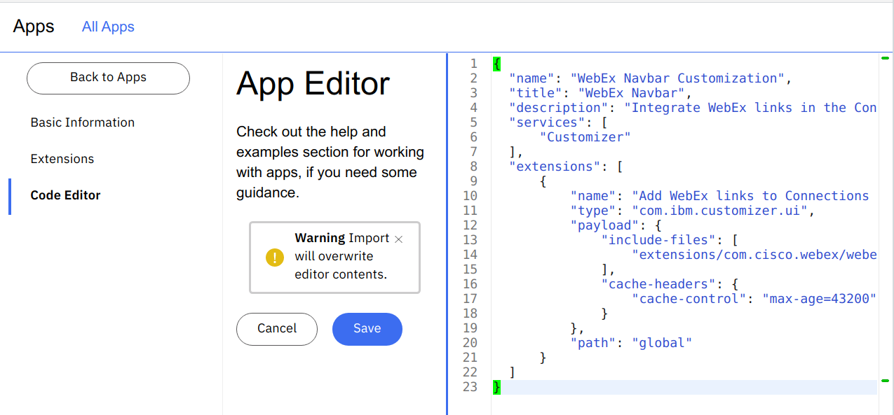
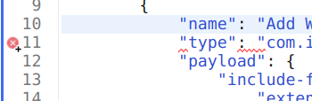
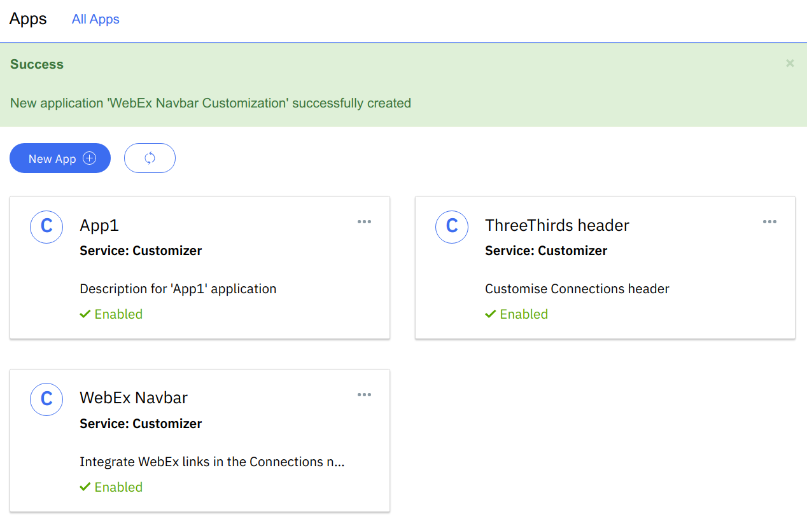

# Install WebEx extension

As an organization admin (orgadmin) goto https://customername.collab.cloud/appreg

## Add a new App



## Open the code editor

Directly open the code editor.



## Delete the default content

Remove the default content and paste the JSON below into the editor.

```json
{
  "name": "WebEx Navbar Customization",
  "title": "WebEx Navbar",
  "description": "Integrate WebEx links in the Connections navbar",
  "services": [
      "Customizer"
  ],
  "extensions": [
      {
          "name": "Add WebEx links to Connections navbar",
          "type": "com.ibm.customizer.ui",
          "payload": {
              "include-files": [
                  "extensions/com.cisco.webex/webex-navbar.js"
              ],
              "cache-headers": {
                  "cache-control": "max-age=43200"
              }
          },
          "path": "global"
      }
  ]
}
```



Ensure that all the braces are there and are closed. The code editor validates the JSON. It shows any syntax errors.



## Save



You should now be able to add your WebEx link. See [using the WebEx extension](../users/using-webex-extension.md)
