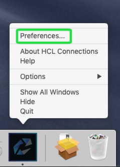
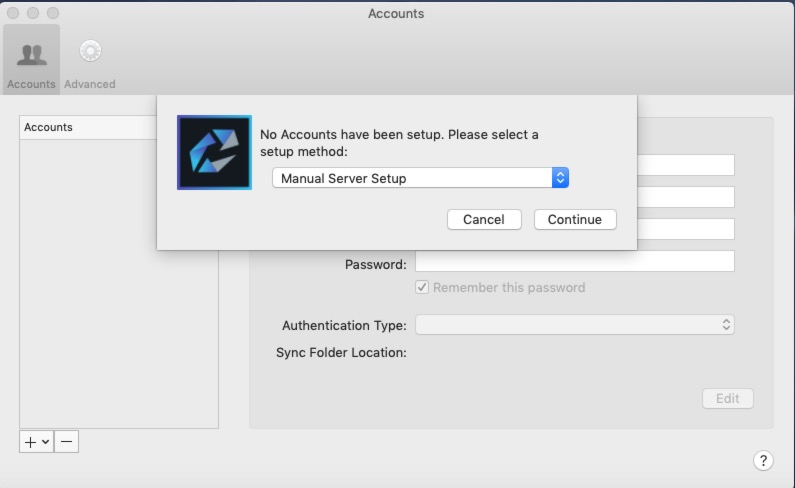
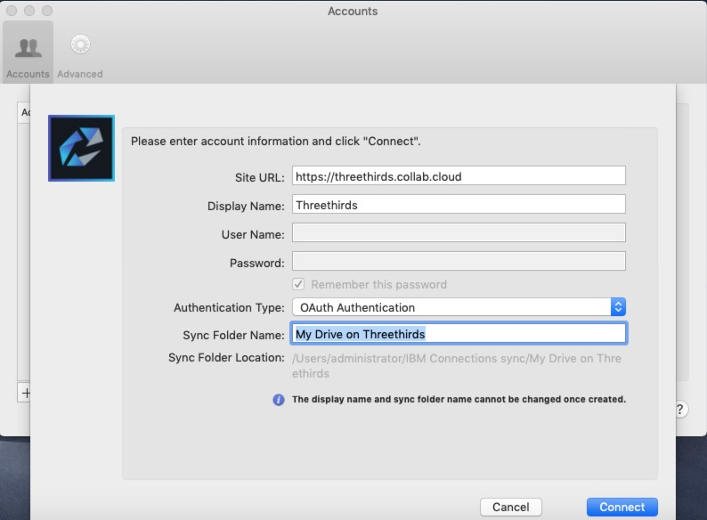
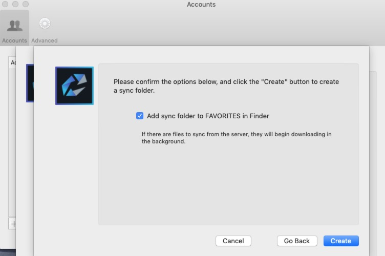

# {:height="28"}HCL Connections for Mac

## Install The Desktop Connector for Mac

### Download

The desktop plugins allow you to sync data locally on your computer and integrate in the operating system. There are 2 versions of them. 1 for Windows and 1 for Mac. You can download those [here](https://docs.collab.cloud/help/downloads/)

### Setup

1. Once you have installed the connector you can configure it by right click on the icon in your menu bar. Choose **_Preferences_**

Select **_Manual Server Setup_**

Fill in the URL of your environment

Confirm with **_Create_**

### Add you Communities

As the list of communities was stored on the client they could not be migrated, you will have to add them again

### How to Use the Software

Information on how to use the Desktop Connector for Mac can be found on the HCL documentation website [here](https://help.hcltechsw.com/connections/v65/connectors/enduser/mac_desktop_plugin_filesync_gs2_2.html)

