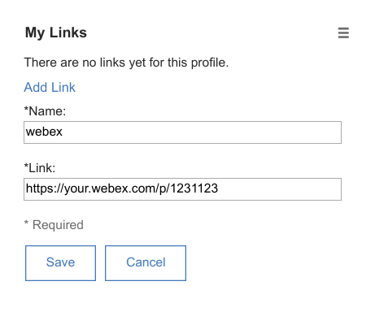
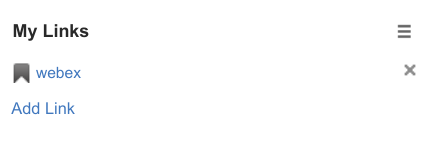
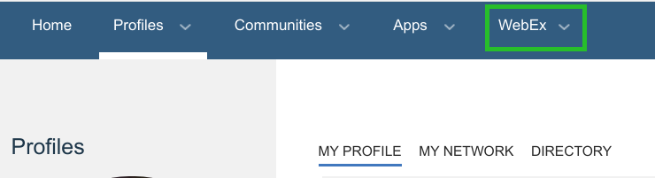

# WebEx extension

The WebEx feature needs to be enabled by your Connections Administrator.

## Configure your WebEx Link

Go to your profile and add your WebEx link to "My Links". The name has to be '**webex**'.

Once the link is saved you should have the webex link ready.

## WebEx menu active

Reload the page and the WebEx menu should appear.

